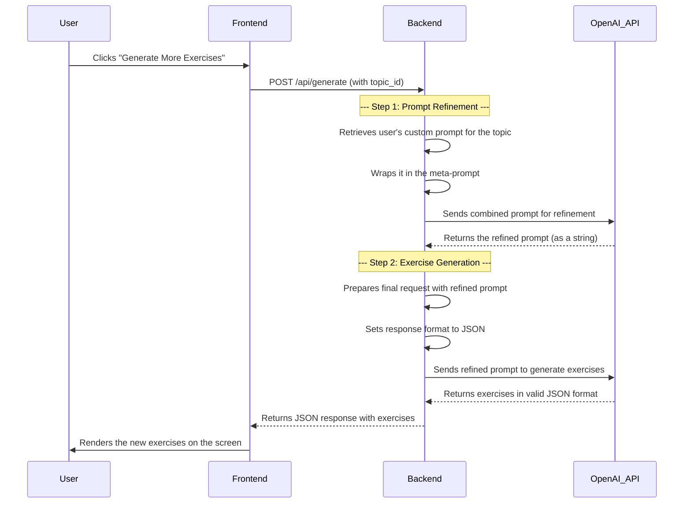

# Prompt Refinement and JSON Schema Flow

This document explains the two-step process used in the German Conjunctions Trainer to generate high-quality, varied exercises. The process involves a **meta-prompt** for refinement and a strictly enforced **JSON schema** for the final output.

## The Goal

The primary goal of this system is to move beyond simple, static prompts and create a more dynamic and intelligent exercise generation pipeline. This ensures that the exercises are not repetitive and maintain a high pedagogical value.

## How It Works

The process can be broken down into two main stages:

1.  **Prompt Refinement**: The user's custom prompt (stored per topic) is improved by an AI assistant.
2.  **Exercise Generation**: The *refined* prompt is used to generate the final list of exercises in a structured JSON format.

---

### Step 1: Prompt Refinement

When the user clicks "Generate More Exercises," the application does not immediately use the prompt associated with the selected topic. Instead, it triggers a "prompt-refinement" step.

1.  **Meta-Prompt**: The backend wraps the user's custom prompt inside a hardcoded **meta-prompt**. This meta-prompt acts as a set of instructions for the language model, telling it to act as a "prompt engineering assistant."

    The meta-prompt instructs the AI to:
    -   Enhance the instructions for more variety and creativity.
    -   Add new examples to clarify the desired output.
    -   Preserve the core task (e.g., generating German conjunction exercises).
    -   **Crucially, not to alter the required JSON schema.**

2.  **Refinement Call**: The combined prompt (meta-prompt + user's prompt) is sent to the language model.

3.  **The Refined Prompt**: The AI's response is not the exercises themselves, but a new, improved prompt. This *refined prompt* is what will be used in the next step.

    > **Observability**: This refined prompt is stored in memory and can be viewed via the "View Last Refined Prompt" button in the settings. This is a key feature for debugging and understanding how the AI is interpreting and improving the prompts.

    > **Fallback**: If this refinement step fails for any reason (e.g., API error, invalid response), the system gracefully falls back to using the user's original, un-refined prompt.

---

### Step 2: Exercise Generation and JSON Schema

Now that the system has a high-quality prompt (either the refined one or the original as a fallback), it proceeds to generate the exercises.

1.  **API Call with JSON Mode**: The refined prompt is sent to the language model, but this time with a special parameter that enforces **JSON output mode**. This ensures that the response is a valid JSON object.

2.  **The Importance of the JSON Schema**: The prompt explicitly defines the expected JSON schema. This is critical for ensuring the frontend can correctly parse and display the exercises.

    The schema typically looks like this:
    ```json
    {
      "type": "object",
      "properties": {
        "exercises": {
          "type": "array",
          "items": {
            "type": "object",
            "properties": {
              "conjunction_topic": { "type": "string" },
              "english_hint": { "type": "string" },
              "correct_german_sentence": { "type": "string" }
            },
            "required": ["conjunction_topic", "english_hint", "correct_german_sentence"]
          }
        }
      },
      "required": ["exercises"]
    }
    ```
    By including this schema definition directly in the prompt, we provide a clear contract for the AI to follow.

3.  **Final Output**: The backend receives a valid JSON object containing an array of exercises. This JSON is then forwarded directly to the frontend, where it is parsed and rendered for the user.

---

## Flow Diagram

This diagram illustrates the entire process, from the user's initial request to the final display of exercises.


